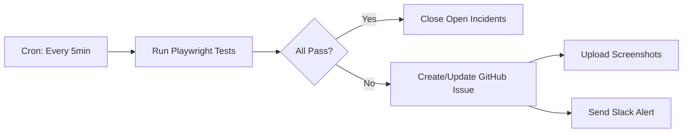

# GitHub Actions Synthetic Monitoring

This document describes the GitHub Actions-based synthetic monitoring solution for lornu.ai, which provides free, automated health checks every 5 minutes.

## Overview

Unlike paid services like BetterStack, this solution:
- ✅ **Free**: Uses GitHub Actions minutes (2,000-3,000/month on free tier)
- ✅ **Automated**: Runs every 5 minutes via cron schedule
- ✅ **Issue Tracking**: Auto-creates/closes GitHub issues for incidents
- ✅ **Multi-Environment**: Supports production, staging, and dev
- ✅ **Artifacts**: Saves screenshots and reports on failures
- ✅ **Slack Integration**: Optional webhook notifications

## How It Works



### Workflow Trigger

The workflow runs automatically every 5 minutes:
```yaml
on:
  schedule:
    - cron: '*/5 * * * *'  # Every 5 minutes
  workflow_dispatch:         # Manual trigger available
```

## Cost Analysis

### GitHub Actions Minutes

**Free Tier**: 2,000 minutes/month
**Per Run**: ~2 minutes (including setup, tests, artifact upload)
**Runs**: 12/hour × 24 hours × 30 days = **8,640 runs/month**
**Total Usage**: 8,640 × 2 = **17,280 minutes/month**

**💰 Cost Breakdown:**
- First 2,000 minutes: **FREE**
- Remaining 15,280 minutes: 15,280 × $0.008 = **$122.24/month**

**Optimization Options:**
1. **Reduce frequency** to every 15 minutes: **$40.75/month** (saves 67%)
2. **Production only**: **$40.75/month** (monitor only prod, manual for staging/dev)
3. **Use self-hosted runner**: **FREE** (requires VPS ~$5/month)

### Comparison to BetterStack

| Feature | BetterStack | GitHub Actions |
|---------|-------------|----------------|
| **Cost** | $42-100/month | $0-122/month (configurable) |
| **Check Frequency** | Every 1-5 minutes | Every 5-15 minutes |
| **Locations** | Multiple regions | Single region (GitHub's runners) |
| **Screenshots** | ✅ Included | ✅ Included (artifacts) |
| **Issue Tracking** | Separate platform | ✅ Native GitHub issues |
| **Status Page** | ✅ Included | ❌ DIY required |
| **On-Call Routing** | ✅ Advanced | ⚠️ Basic (Slack/Email) |

## Configuration

### 1. Enable the Workflow

The workflow is located at `.github/workflows/synthetic-monitoring.yml` and activates automatically once pushed to `main` or `gcp-develop`.

### 2. Configure Environments

Edit the workflow to set your environment URLs:

```yaml
env:
  PRODUCTION_URL: https://lornu.ai
  STAGING_URL: https://staging.lornu.ai  # Update if different
  DEV_URL: https://d2.lornu.ai
```

### 3. (Optional) Add Slack Notifications

1. Create a Slack webhook: https://api.slack.com/messaging/webhooks
2. Add it as a **repository variable** (not secret) in GitHub:
   - Go to: Settings → Secrets and variables → Actions → Variables
   - Name: `SLACK_WEBHOOK_URL`
   - Value: `https://hooks.slack.com/services/YOUR/WEBHOOK/URL`

### 4. Adjust Check Frequency

To reduce costs, change the cron schedule:

```yaml
# Every 5 minutes (default)
- cron: '*/5 * * * *'

# Every 15 minutes (recommended for cost optimization)
- cron: '*/15 * * * *'

# Every 30 minutes
- cron: '*/30 * * * *'

# Every hour
- cron: '0 * * * *'
```

## Usage

### Automatic Monitoring

Once enabled, the workflow runs automatically. No action required.

### Manual Checks

Trigger a manual check from GitHub:
1. Go to: Actions → Synthetic Monitoring
2. Click "Run workflow"
3. Select environment (production/staging/development)
4. Click "Run workflow"

### Viewing Results

**Workflow Runs:**
- https://github.com/lornu-ai/lornu-ai/actions/workflows/synthetic-monitoring.yml

**Incident Issues:**
- Filter by label: `synthetic-monitoring incident`
- Example: https://github.com/lornu-ai/lornu-ai/issues?q=label%3Asynthetic-monitoring+label%3Aincident

**Artifacts (Screenshots, Reports):**
- Available on each workflow run for 30 days
- Click on a run → Artifacts section → Download

## Incident Management

### When Tests Fail

1. **GitHub Issue Created**:
   - Title: `🚨 Synthetic Monitoring Alert: production (https://lornu.ai)`
   - Labels: `synthetic-monitoring`, `incident`, `env:production`, `priority:high`
   - Body includes: Failed tests, error messages, links to artifacts

2. **Subsequent Failures**:
   - Updates same issue with new comment
   - Doesn't spam with new issues

3. **Recovery**:
   - Automatically closes issue when tests pass
   - Adds "✅ Resolved" comment

### Alert Fatigue Prevention

The workflow prevents spam by:
- Updating existing incidents instead of creating duplicates
- Auto-closing when resolved
- Providing detailed error messages to help with debugging

## Monitored Checks

The workflow runs the same Playwright tests we created earlier:

### Health Checks

| Check | Endpoint/Element | Timeout | Failure Impact |
|-------|------------------|---------|----------------|
| API Health | `/api/health` | 5s | Creates incident |
| Homepage Load | Title: "LornuAI" | 15s | Creates incident |
| Navigation | `<nav>` element | 5s | Creates incident |
| Contact Form | Form inputs | 10s | Creates incident |
| JavaScript Errors | Console monitoring | N/A | Creates incident* |

\* *Note: Currently disabled due to known React createContext error (PR #333/#335)*

## Troubleshooting

### Workflow Not Running

**Issue**: No runs appearing in Actions tab
**Solutions**:
- Ensure workflow is on `main` or `gcp-develop` branch
- Check if Actions are enabled: Settings → Actions → General → "Allow all actions"
- Cron can take up to 10 minutes to start on the first schedule

### High Costs

**Issue**: GitHub Actions bill is too high
**Solutions**:
1. **Reduce frequency**: Change to `*/15 * * * *` (every 15 minutes)
2. **Monitor production only**: Remove staging/dev from environments
3. **Use self-hosted runner**: Set up a $5/month VPS with GitHub runner

### False Positives

**Issue**: Tests failing but site is accessible
**Solutions**:
- Increase timeouts in `betterstack-monitoring.spec.ts`
- Add retries: Update workflow to retry failed tests
- Temporarily disable flaky tests

### Screenshots Not Available

**Issue**: Screenshots not uploaded on failure
**Solutions**:
- Check artifact retention (default: 7 days for screenshots)
- Ensure tests are generating screenshots (`screenshot: 'only-on-failure'` in playwright.config.ts)

## Advanced Configuration

### Custom Test Suite

To add custom checks, edit:
```
apps/web/tests/e2e/betterstack-monitoring.spec.ts
```

Add new tests like:
```typescript
test('Custom check: Login flow works', async ({ page }) => {
  await page.goto('https://lornu.ai/login');
  // Your test logic here
});
```

### Multi-Region Monitoring

GitHub Actions runs on GitHub's infrastructure (typically US-based). For multi-region:

**Option 1**: Use multiple self-hosted runners in different regions
**Option 2**: Integrate with a multi-region service (e.g., Checkly, uptime.com)
**Option 3**: Accept single-region monitoring as trade-off for cost

### Integration with PagerDuty

Add PagerDuty alerting:

1. Create a PagerDuty integration: https://developer.pagerduty.com/docs/ZG9jOjExMDI5NTgw-events-api-v2-overview
2. Add to workflow after "Create or Update Incident Issue":

```yaml
- name: Trigger PagerDuty Alert
  if: steps.parse-results.outputs.success == 'false'
  run: |
    curl -X POST https://events.pagerduty.com/v2/enqueue \
      -H 'Content-Type: application/json' \
      -d '{
        "routing_key": "${{ secrets.PAGERDUTY_INTEGRATION_KEY }}",
        "event_action": "trigger",
        "payload": {
          "summary": "Synthetic monitoring failure on ${{ steps.set-url.outputs.env }}",
          "severity": "error",
          "source": "GitHub Actions"
        }
      }'
```

## Recommended Configuration

For **cost-effective production monitoring**:

```yaml
on:
  schedule:
    # Every 10 minutes (balances cost vs. detection speed)
    - cron: '*/10 * * * *'

env:
  # Monitor production only by default
  PRODUCTION_URL: https://lornu.ai
```

**Monthly Cost**: ~$61/month
**Detection Time**: Max 10 minutes
**Coverage**: Production environment

## Migration from BetterStack

If migrating from BetterStack:

1. ✅ Push this workflow to `main` or `gcp-develop`
2. ✅ Verify first run completes successfully
3. ✅ Monitor for 24 hours to ensure stability
4. ✅ Cancel BetterStack subscription
5. ✅ Update on-call documentation to reference GitHub issues

## Support

For issues with the monitoring workflow:
- Check workflow logs: Actions → Synthetic Monitoring → Latest run
- Review test artifacts for screenshots
- Open an issue with label `synthetic-monitoring`

## Related Documentation

- [BetterStack Setup Guide](./BETTERSTACK_MONITORING.md) (alternative)
- [Playwright E2E Tests](../apps/web/tests/e2e/)
- [GitHub Actions Workflows](../.github/workflows/)
